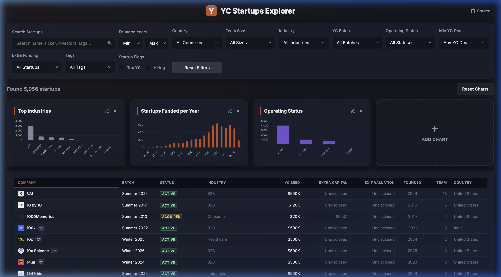

# YC Startups Explorer

Explore, search, filter, and visualize the full dataset of **5,950+** Y Combinator funded startups in a sleek, interactive financial & temporal dashboard.

[](https://truedoday.github.io/ycexplorer/)

### 🔗 Live Demo: [truedoday.github.io/ycexplorer](https://truedoday.github.io/ycexplorer/)

---

## 🚀 Overview

**YC Startups Explorer** is a high-performance frontend dashboard designed to explore the rich history of Y Combinator cohort companies. It integrates interactive visualizations (via Chart.js), a fast server-less filter engine, detailed modals for startup profiles, and custom multi-select filters.

The underlying data is programmatically aggregated from Y Combinator's public search index and enriched with clean financial parameters.

## 🌟 Key Features

* **Interactive Charts**:
  * **Top Industries**: Bar chart distribution of the most popular startup categories.
  * **Startups Funded per Year**: Chronological cohort volume tracker, displaying a default timeline of 23 years.
  * **Operating Status**: Visual breakdown of active, acquired, public, and inactive companies.
* **Custom Multiselect Dropdowns**: Multi-select filtering for **Country**, **Team Size**, **Industry**, **YC Batch**, **Operating Status**, **Min YC Deal**, **Extra Funding**, and **Tags**.
* **Flexible Search**: Search instantly by name, one-liner, description, tag, industry, ticker, or investors.
* **Airtable-Style Sorting**: Click column headers on the dense tabular view to sort instantly by name, batch, status, deal size, country, etc. Active sorting persists across page reloads.
* **State Persistence & Reset**: All active filters, search queries, table sorting, and chart dashboard layouts (additions, deletions, drag-and-drop reordering) are stored in cookies, restoring the workspace automatically on refresh. A 'Reset Charts' button in the results header clears layouts back to defaults.
* **Comprehensive Modal Views**: Click any company row to open a full details dialog, featuring:
  * Company pitch, long description, and former names.
  * Financial profile (YC deal, extra capital, exit value, investors, ticker).
  * Direct links to official websites and YC directory profiles.
  * Scroll state persistence fix (prevents scroll position bleed between company views).

---

## 🛠️ Getting Started & Running Locally

Since the application runs entirely on static files (`index.html`, `app.js`, `style.css`, and the minified dataset `yc_startups_min.json`), you can run it locally with zero build steps:

1. **Clone the repository**:
   ```bash
   git clone https://github.com/Truedoday/ycexplorer.git
   cd ycexplorer
   ```

2. **Start a local development server**:
   * Using Python (recommended):
     ```bash
     python3 -m http.server 8000
     ```
   * Using Node/npm:
     ```bash
     npx serve
     ```

3. **Open the browser**:
   Go to [http://localhost:8000](http://localhost:8000) or the port provided by your server.

---

## 📂 Repository Structure & Dataset Files

This repository contains both the frontend explorer application and the utility scripts / raw data files:

* **Explorer App**:
  * [`index.html`](./index.html): Semantic HTML5 structure.
  * [`style.css`](./style.css): Vanilla CSS styling featuring glassmorphism and responsiveness.
  * [`app.js`](./app.js): Core logic, multiselect components, search/filter algorithms, and Chart.js integrations.
  * [`yc_startups_min.json`](./yc_startups_min.json): Enriched, minified dataset optimized for quick page load.
* **Raw & Tabular Data**:
  * [`yc_startups.json`](./yc_startups.json): Full nested JSON metadata for developer consumption.
  * [`yc_startups.csv`](./yc_startups.csv): Tabular dataset (lists converted to semicolon-separated lists) for Excel/Pandas analysis.
* **Scripts**:
  * [`generate_dataset.py`](./generate_dataset.py): Python script that fetches and extracts the raw YC directory dataset.
  * [`enrich_dataset_real.py`](./enrich_dataset_real.py): Enrichment script adding financial parameters and tags.
  * [`minify_dataset.py`](./minify_dataset.py): Minimizes metadata for the dashboard frontend.

---

## 📊 Dataset Summary Statistics (June 2026)

### Overview
* **Total Companies**: 5,956
* **YC Top Companies 🏆**: 91
* **Currently Hiring 💼**: 1,480
* **Non-Profits 🎗️**: 42

### Operational Status
* **Active**: 4,105 (68.9%)
* **Inactive**: 1,040 (17.5%)
* **Acquired**: 788 (13.2%)
* **Public**: 23 (0.4%)

### Top 10 Industries
* **B2B**: 3,044 companies
* **Consumer**: 869 companies
* **Healthcare**: 679 companies
* **Fintech**: 632 companies
* **Industrials**: 389 companies
* **Real Estate and Construction**: 159 companies
* **Education**: 125 companies
* **Government**: 41 companies
* **Unspecified**: 18 companies

---

## 🔄 Re-generating the Dataset

You can update the dataset files by running:

```bash
python3 generate_dataset.py
```

*Note: This dataset represents only launched, publicly listed YC startups. Stealth companies or those requesting directory exclusion are not included.*
